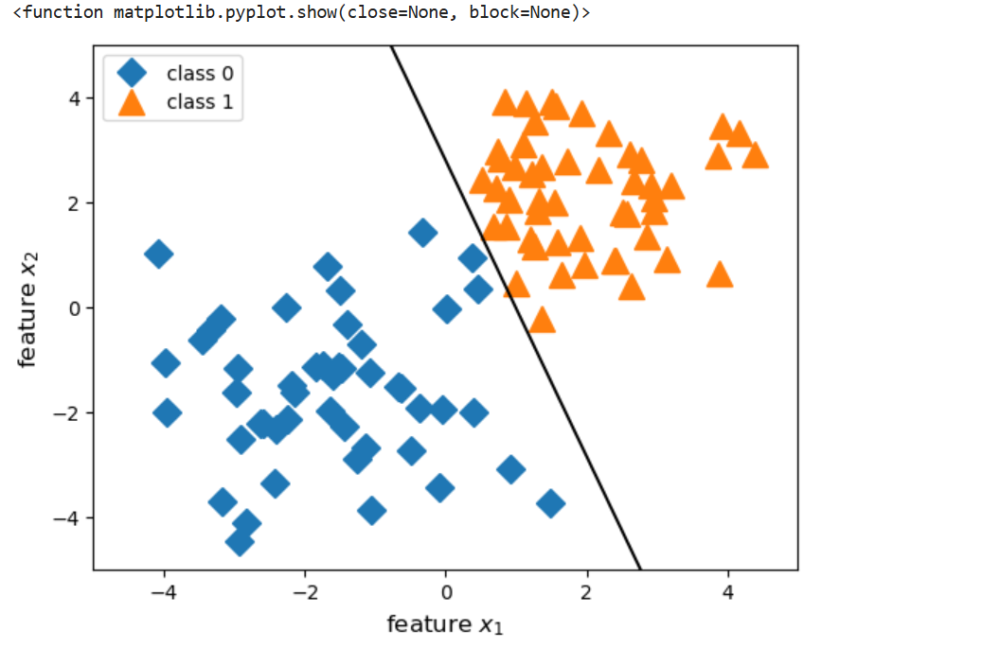

# World's First Perceptron ML Model – Built Entirely in Jupyter Notebook 🌍🧠

Hey there! 👋  
Welcome to my tiny corner of machine learning history — where I decided to roll up my sleeves and build the **Perceptron algorithm from scratch** in a good old **Jupyter Notebook**.

No fancy frameworks. No shortcuts.  
Just **NumPy**, **Pandas**, and **Matplotlib**.

## 🚀 What’s Inside?

- ✅ A working Perceptron (yes, I wrote it from scratch!)
- 📊 A toy dataset crafted for testing — included in the repo
- 📈 Beautiful visualizations of the **decision boundary** as it learns
- 🧪 Manual training loop you can tweak, poke, or break (for science!)

---

## 📁 Files You’ll Find

| File | Description |
|------|-------------|
| `Perceptron_From_Scratch.ipynb` | The main notebook — contains code, explanation, and plots |
| `toydata.csv` | A simple dataset to test the Perceptron |
|  `README.md` | You’re reading it! |

---

## 🛠️ Tech Stack

- **Python 3**
- **NumPy** – for vectorized math magic
- **Pandas** – for easy CSV handling and data inspection
- **Matplotlib** – to draw those satisfying decision boundaries

---

## 🎯 Why I Built This

I've always been fascinated by the simplicity and brilliance of early machine learning models. The Perceptron was proposed by **Frank Rosenblatt in 1958** — a time when even the term "machine learning" wasn't mainstream.

I wanted to **recreate that magic**, without using any ML libraries — purely to understand the math and logic behind it.

> This isn’t just code — it’s my personal tribute to the foundations of AI.

---

## 📸 A Glimpse of the Output

> _(If image doesn’t load, try running the notebook to generate your own!)_

---

## 🧪 How to Run It
1. Clone the repo or download the files  
2. Open the notebook in **Jupyter Notebook** or **Google Colab**
3. Make sure `toydata.csv` is in the same folder
4. Run the notebook and follow along!
---

## 🤝 Let's Connect

Have ideas, feedback, or just want to nerd out over ML models?

- 📬 Reach me at: **[sraj55355@gmail.com]**
- 🧠 LinkedIn / GitHub: **[@rajshinde]([https://github.com/rajshinde2004](https://www.linkedin.com/in/raj-shinde-77bb952b5/))**

---

### 👑 Final Thoughts

Building this project was a reminder that we don’t always need massive libraries or black-box models to learn. Sometimes, **a few lines of NumPy** and a plot or two is all it takes to appreciate the foundations of machine learning.

Thanks for checking it out — and if you found it helpful, give it a ⭐️ on GitHub and feel free to fork!

---

Made with ❤️ in Jupyter Notebook  
— **Raj Shinde**
